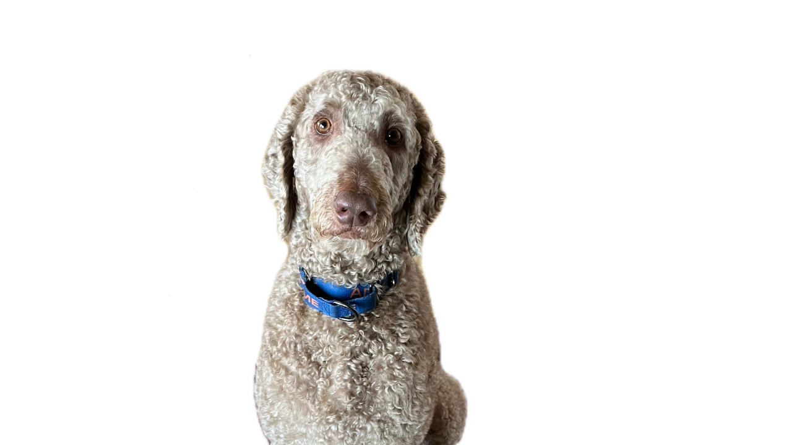

### [_Watson's DNA test results_](http://embk.me/watson1161?utm_campaign=cns_ref_dog_pub_profile&utm_medium=other&utm_source=embark)

# Weekly Focus Areas:
1) **Missions** [link](https://docs.google.com/spreadsheets/d/1AKUyX6h1IlNM33kA-pKEyjt6FO-edaGJhS-3ZKl7Ank/edit#gid=1492869044)

   
2) **Relaxation Protocol** [link](https://journeydogtraining.com/wp-content/uploads/2017/07/ProtocolforRelaxation.pdf)  
   
3) **Take a Breath work** [link](https://www.youtube.com/watch?v=bdffTkxqlZQ)

# Medications:
| Medication            | Type         | Dosage | Time of Day | Notes                                           |
|-----------------------|--------------|--------|-------------|-------------------------------------------------|
| **Trazadone**         | Short acting | 100mg  | 3x per day  | 6am, 3pm, 9pm                                   |
| **Fluoxetine HCL**    | Long acting  | 20mg   | 1x per day  | 9:00 PM, 7 days @ 1/2 dose started on 3/14      |

# Dog Training Resources:
## Table of Contents
- [Weekly Focus Areas:](#weekly-focus-areas)
- [Medications:](#medications)
- [Dog Training Resources:](#dog-training-resources)
  - [Table of Contents](#table-of-contents)
    - [Missions:](#missions)
      - [Shared Google Doc](#shared-google-doc)
    - [Relaxing:](#relaxing)
    - [Dog Conditioning:](#dog-conditioning)
    - [Recommended Reading](#recommended-reading)

> \*_Note: To open links in a new tab, right-click the link and select "Open Link in New Tab"._    

### Missions:
#### [Shared Google Doc](https://docs.google.com/spreadsheets/d/1AKUyX6h1IlNM33kA-pKEyjt6FO-edaGJhS-3ZKl7Ank/edit#gid=1492869044)
 

### Relaxing:

* Relax on mat video- [link](https://www.youtube.com/watch?v=4tQs6lHKLCY)
 
* Relax on mat pdf- [link](https://babysafedogtraining.com/wp-content/uploads/2012/04/Relax_on_a_mat.pdf)

* Protocol for relaxation- [link](https://journeydogtraining.com/wp-content/uploads/2017/07/ProtocolforRelaxation.pdf)

* Clicker Training- [link](https://www.clickertraining.com/fundamentals)

* Train without a Clicker- [link](https://www.youtube.com/watch?v=Ruez2Mn7sn4&t=38s)

* Take a Breath- [link](https://www.youtube.com/watch?v=bdffTkxqlZQ)

### Dog Conditioning: 

* Easy exercises- [link](https://www.akc.org/expert-advice/training/easy-exercises-for-canine-conditioning)

* Running the stairs:
Start at the top of the stairs. Ask Watson to do any behavior he knows, like sit, down, shake, spin, etc. Click/verbally mark when they do it, then toss a treat to the bottom of the steps. Encourage him to go get it, then rinse and repeat. This is an easy way to physically tire him quickly.

* Dog parkour- [link](https://www.dogparkour.org/training-level)

* Perch work- [link](https://www.youtube.com/watch?v=O6sj6fTJnFc)

### Recommended Reading
* [Don't Shoot the Dog](https://mandrillapp.com/track/click/31423210/www.dogwise.com?p=eyJzIjoiMDRfSUloQWM3VDdGSkhIZWJreGZ1dmVCcGQwIiwidiI6MSwicCI6IntcInVcIjozMTQyMzIxMCxcInZcIjoxLFwidXJsXCI6XCJodHRwczpcXFwvXFxcL3d3dy5kb2d3aXNlLmNvbVxcXC9kb250LXNob290LXRoZS1kb2ctdGhlLWFydC1vZi10ZWFjaGluZy1hbmQtdHJhaW5pbmdcXFwvP2FmZj0yMzlcIixcImlkXCI6XCIwY2YyODQ2Mzg3MzA0ZWMyOTAwZjZiY2UzMGU3OTI5MVwiLFwidXJsX2lkc1wiOltcImMxYjRmZDA4NGI4Y2YwYjI1MTNhMjM5Nzk4YzQ4Yjg1Mjg3ZGUxZDVcIl19In0)
 by Karen Pryor  

* [Control Unleashed: Reactive To Relaxed](https://mandrillapp.com/track/click/31423210/www.dogwise.com?p=eyJzIjoibDRMei1oNS1pcV9hNG5TcU43bFFCQ1NzWS1RIiwidiI6MSwicCI6IntcInVcIjozMTQyMzIxMCxcInZcIjoxLFwidXJsXCI6XCJodHRwczpcXFwvXFxcL3d3dy5kb2d3aXNlLmNvbVxcXC9jb250cm9sLXVubGVhc2hlZC1yZWFjdGl2ZS10by1yZWxheGVkXFxcLz9hZmY9MjM5XCIsXCJpZFwiOlwiMGNmMjg0NjM4NzMwNGVjMjkwMGY2YmNlMzBlNzkyOTFcIixcInVybF9pZHNcIjpbXCIxZGViNzI4ZTZkY2ZhOGJhMjdhYjM2NTNmZWVlYjhjNjBkYWFlNTU2XCJdfSJ9)
(Book 3) by Leslie McDevitt  

* [Fired Up, Frantic, and Freaked Out](https://mandrillapp.com/track/click/31423210/www.dogwise.com?p=eyJzIjoiNUIzUEc1QUhRbVFINC1GVXNueFdDVkJWbkpvIiwidiI6MSwicCI6IntcInVcIjozMTQyMzIxMCxcInZcIjoxLFwidXJsXCI6XCJodHRwczpcXFwvXFxcL3d3dy5kb2d3aXNlLmNvbVxcXC9maXJlZC11cC1mcmFudGljLWFuZC1mcmVha2VkLW91dC10cmFpbmluZy10aGUtY3JhenktZG9nLWZyb20tb3Zlci10aGUtdG9wLXRvLXVuZGVyLWNvbnRyb2wtMVxcXC8_YWZmPTIzOVwiLFwiaWRcIjpcIjBjZjI4NDYzODczMDRlYzI5MDBmNmJjZTMwZTc5MjkxXCIsXCJ1cmxfaWRzXCI6W1wiYTdkOTllY2QzYTdiZWIyMDZkZjBlYzJhYjAyYTBkMmI0Mzk2NDY0NlwiXX0ifQ)
by Laura Van Arendonk Baugh  

* [Way to Go! How to House Train at Any Age](https://mandrillapp.com/track/click/31423210/www.dogwise.com?p=eyJzIjoidThXYVoyQlh3dzdtSmpVSzJiTEEzS2FpSzlJIiwidiI6MSwicCI6IntcInVcIjozMTQyMzIxMCxcInZcIjoxLFwidXJsXCI6XCJodHRwczpcXFwvXFxcL3d3dy5kb2d3aXNlLmNvbVxcXC93YXktdG8tZ28taG93LXRvLWhvdXNldHJhaW4tYS1kb2ctb2YtYW55LWFnZVxcXC8_YWZmPTIzOVwiLFwiaWRcIjpcIjBjZjI4NDYzODczMDRlYzI5MDBmNmJjZTMwZTc5MjkxXCIsXCJ1cmxfaWRzXCI6W1wiMmIwMGVjZWU1MDVjOWU4OTViNGUwYjE1OGI2YTkyMzc2NzQxYTczZlwiXX0ifQ)
by P. McConnell & K London  

* [Don't Leave Me](https://mandrillapp.com/track/click/31423210/www.dogwise.com?p=eyJzIjoiRGJfV0M3ZXFlMHI3SzV0X3hhZXg0eWZXNUpVIiwidiI6MSwicCI6IntcInVcIjozMTQyMzIxMCxcInZcIjoxLFwidXJsXCI6XCJodHRwczpcXFwvXFxcL3d3dy5kb2d3aXNlLmNvbVxcXC9kb250LWxlYXZlLW1lLXN0ZXAtYnktc3RlcC1oZWxwLWZvci15b3VyLWRvZ3Mtc2VwYXJhdGlvbi1hbnhpZXR5XFxcLz9hZmY9MjM5XCIsXCJpZFwiOlwiMGNmMjg0NjM4NzMwNGVjMjkwMGY2YmNlMzBlNzkyOTFcIixcInVybF9pZHNcIjpbXCJhYjIzZTFiNTA2MDQxY2JjZTQyZTU2ZThlY2Y3MzA4YWFjZTgwMzBiXCJdfSJ9)
by Nicole Wilde  

* [Barking: The Sound of Language](https://mandrillapp.com/track/click/31423210/www.dogwise.com?p=eyJzIjoiSjZMWk9qQmhxUzF3S1l5S1I0cUkxX2xIZkIwIiwidiI6MSwicCI6IntcInVcIjozMTQyMzIxMCxcInZcIjoxLFwidXJsXCI6XCJodHRwczpcXFwvXFxcL3d3dy5kb2d3aXNlLmNvbVxcXC9iYXJraW5nLXRoZS1zb3VuZC1vZi1hLWxhbmd1YWdlXFxcLz9hZmY9MjM5XCIsXCJpZFwiOlwiMGNmMjg0NjM4NzMwNGVjMjkwMGY2YmNlMzBlNzkyOTFcIixcInVybF9pZHNcIjpbXCJlYTQzMmYxMGY5OTY5YWNmYmNlZWZjNTI1NWZhOWVjYjNhMmE0N2I1XCJdfSJ9)
by Turid Rugaas  

* [My Dog Pulls, What do I do?](https://mandrillapp.com/track/click/31423210/www.dogwise.com?p=eyJzIjoiWlhqU185ZGNUZGhzZnRhb2daV2dpMS1iVklZIiwidiI6MSwicCI6IntcInVcIjozMTQyMzIxMCxcInZcIjoxLFwidXJsXCI6XCJodHRwczpcXFwvXFxcL3d3dy5kb2d3aXNlLmNvbVxcXC9teS1kb2ctcHVsbHMtd2hhdC1kby1pLWRvXFxcLz9hZmY9MjM5XCIsXCJpZFwiOlwiMGNmMjg0NjM4NzMwNGVjMjkwMGY2YmNlMzBlNzkyOTFcIixcInVybF9pZHNcIjpbXCI5YmJjNDNmZTIyNGU2NmM2NDYxMGZlMDU4ZTc2MDZkYjNmMjBkNGM3XCJdfSJ9)
by Turid Rugaas  

* [Click to Calm](https://mandrillapp.com/track/click/31423210/www.dogwise.com?p=eyJzIjoiMWlDcWtjWUo2Tm93Z1ltVlhXS2dlX19HT2hnIiwidiI6MSwicCI6IntcInVcIjozMTQyMzIxMCxcInZcIjoxLFwidXJsXCI6XCJodHRwczpcXFwvXFxcL3d3dy5kb2d3aXNlLmNvbVxcXC90aGUtbmV3LWNsaWNrLXRvLWNhbG0tc29sdXRpb25zLWZvci1hbGwtZG9ncy1pbi1hLWNoYWxsZW5naW5nLXdvcmxkXFxcLz9hZmY9MjM5XCIsXCJpZFwiOlwiMGNmMjg0NjM4NzMwNGVjMjkwMGY2YmNlMzBlNzkyOTFcIixcInVybF9pZHNcIjpbXCJkMmMzOTFlOGY3MmQ1YzJjOTI0NGQyY2Q1YzM2OGVlODc2ZTBhNzA4XCJdfSJ9)
by Emma Parson  

